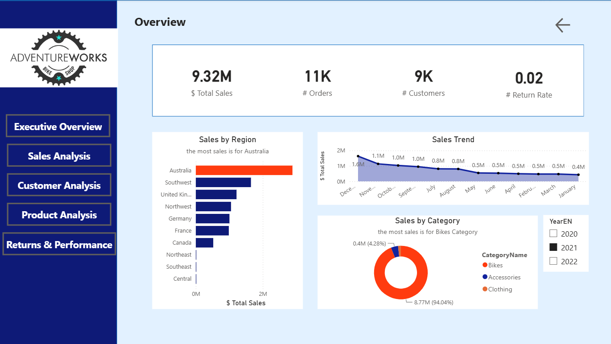
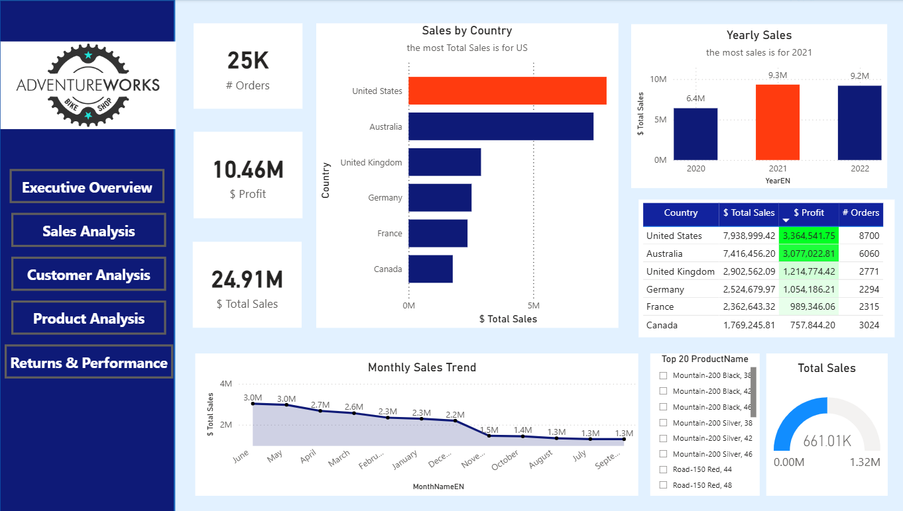
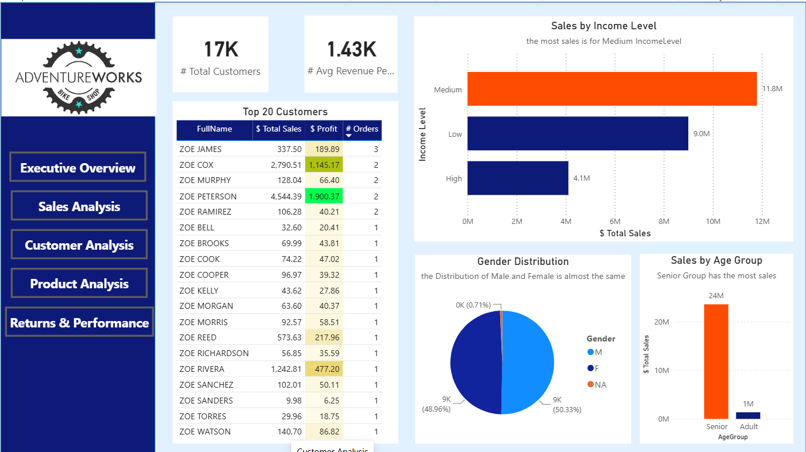
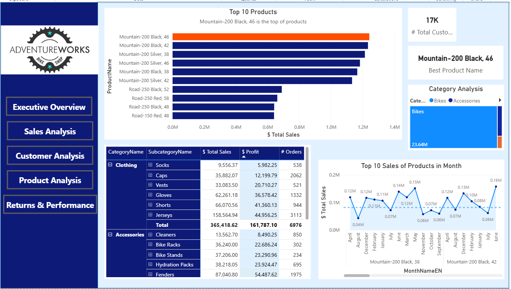
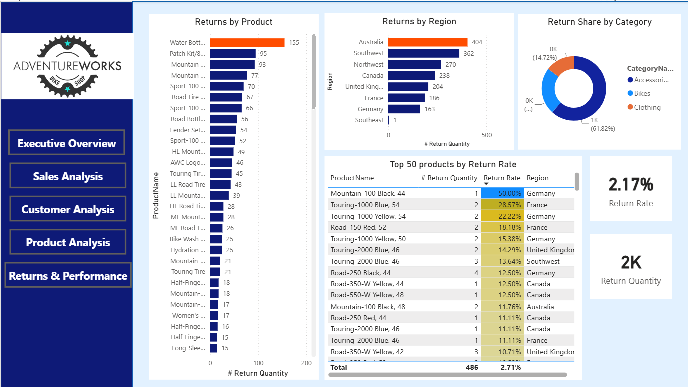

# Adventure-Work-Power-bi-Analysis
Power BI analysis and ETL  of football Adventure Work Data

## Overview

This project analyzes Adventure-Work Data using Power BI.

The project includes:

- ETL
- Power BI Dashboard

---

## Workflow

Raw Data

↓

ETL

↓

Null Handling

↓

Power BI Dashboard

---

## Technologies

- Power BI
- GitHub

---

## Dashboard Pages

- Executive Overview
- Sales Analysis
- Customer Analysis
- Product Analysis
- Returns & Performance
- CategoryToltip

---

## Repository Structure

├── data
├── images
├── powerbi
└── README.md

### Executive Overview

---

### Sales Analysis

---

### Customer Analysis

---

### Product Analysis

---

### Returns & Performance

---

